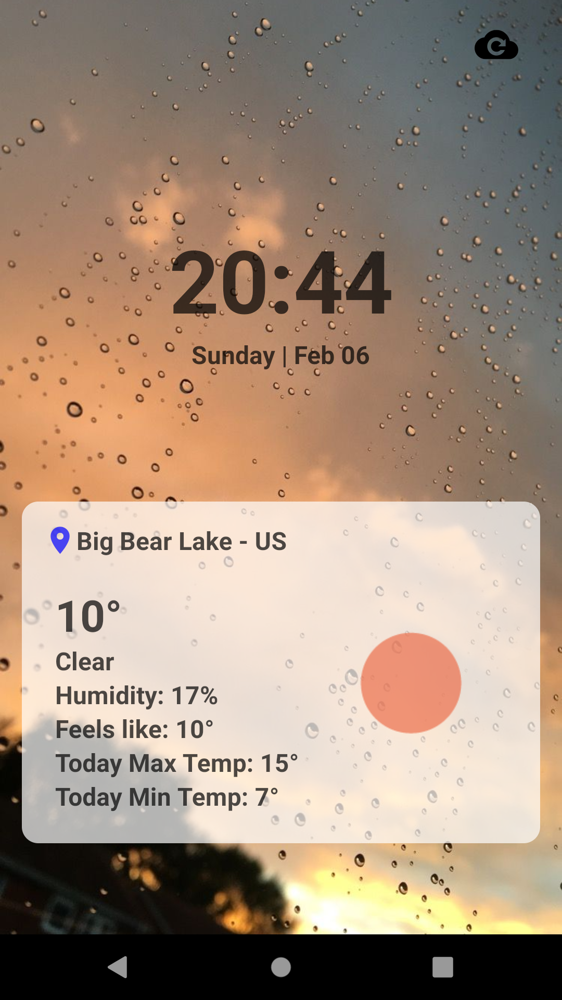
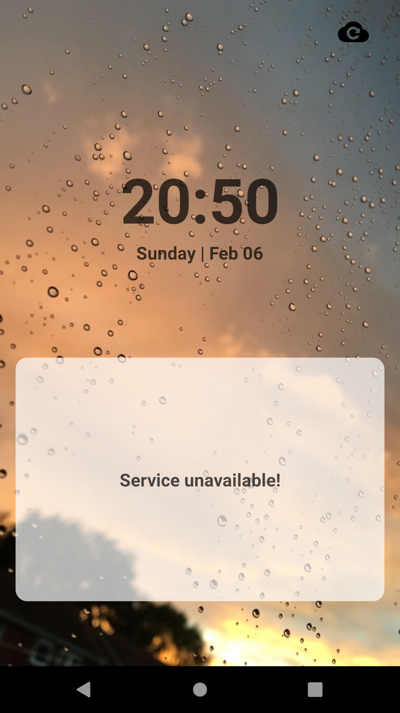
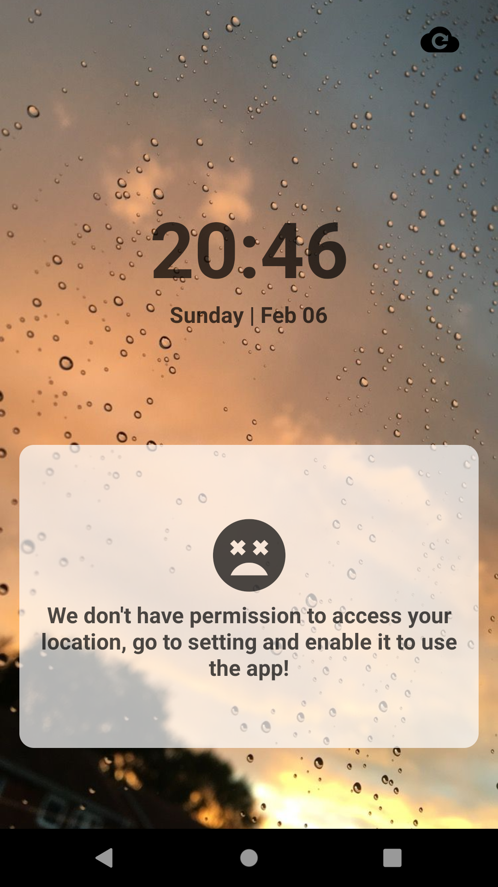

# Weather App

-OBS: Por motivos demonstrativos os arquivos .env e keystore estão salvos diretamente no repositório do projeo.

### About App

- Desenvolva um aplicativo que consuma a localização atual do usuário e exiba na interface o endereço atual os dados climáticos da região e um botão para atualizar os dados.
 
 A api utilizada foi a [OpenWeatherApi](https://openweathermap.org/api)

### Screenshots

### Pacotes adicionais

#### axios:

- Promise based HTTP client for the browser and node.js

#### react-native-vector-icons:

- Customizable Icons for React Native with support for NavBar/TabBar/ToolbarAndroid, image source and full styling.

#### styled-components:

- Visual primitives for the component age. Use the best bits of ES6 and CSS to style your apps without stress

#### react-native-dotenv:

- Load environment variables using import statements

#### @testing-library/react-native

- Simple and complete React Native testing utilities that encourage good testing practices.

#### @react-native-community/geolocation

- React Native Geolocation Module for iOS and Android

### Run and Build !?!

- DEBUG (apenas android)

  * android: 
    - No terminal rode o comando 'yarn android'

- RELEASE
    * android:
      - apk: no terminal rode o comnado 'yarn build:apk'
      - bundle release: no terminal rode o comnado  'yarn build:bundle'

* Certifique-se de ter instalado os pacotes de projeto. Rode no terminal o comando 'yarn'.

[Download do APK] (https://github.com/tassiomr/weather-app/blob/develop/app-release.apk)
